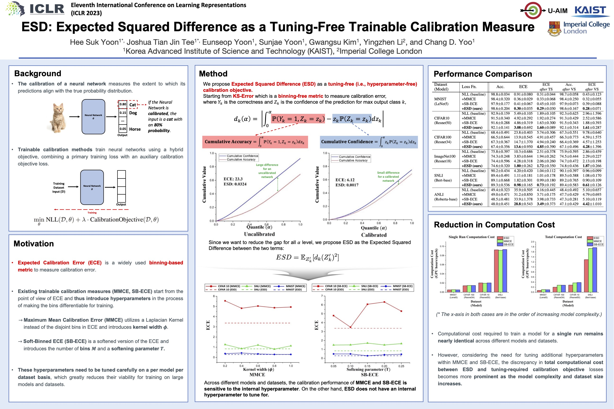

# ESD: Expected Squared Difference as a Tuning-Free Trainable Calibration Measure

[[Paper Link](https://openreview.net/forum?id=bHW9njOSON)]


## Requirements 
A suitable conda environment named subject-diffusion can be created and activated with:
```
conda env create -f environment.yaml
conda activate esd
```

## Prepare Datasets

Prepare ImageNet-100 dataset based on the following link https://github.com/danielchyeh/ImageNet-100-Pytorch

## Running Experiments
`script/baseline.sh`, `script/esd.sh`, `script/mmce.sh`, `script/sbece.sh` contain commands to run the baseline (NLL), NLL+ESD, NLL+MMCE, and NLL+SB-ECE, respectively. Change the path to the ImageNet-100 dataset in the bash files before running.

```
CUDA_VISIBLE_DEVICES=0 bash script/baseline.sh
```

## Citation
If you find our work useful in your research, please cite:
```
@inproceedings{
yoon2023esd,
title={{ESD}: Expected Squared Difference as a Tuning-Free Trainable Calibration Measure},
author={Hee Suk Yoon and Joshua Tian Jin Tee and Eunseop Yoon and Sunjae Yoon and Gwangsu Kim and Yingzhen Li and Chang D. Yoo},
booktitle={The Eleventh International Conference on Learning Representations },
year={2023},
url={https://openreview.net/forum?id=bHW9njOSON}
}
```

## Contact
If you have any questions, please feel free to email hskyoon@kaist.ac.kr
